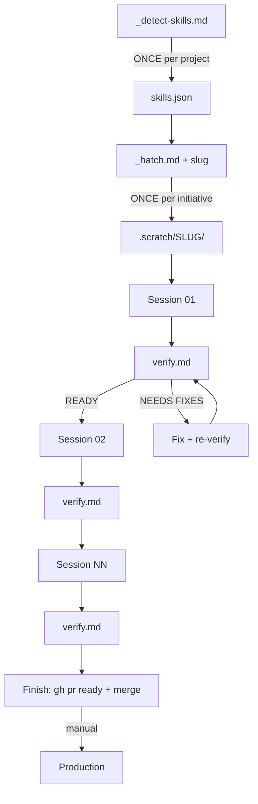

# How to use PromptHatch

A friendly walkthrough of the 6-step lifecycle that takes a new initiative from blank slate to production-ready code.

## Table of contents

- [Concepts in 60 seconds](#concepts-in-60-seconds)
- [The 6-step lifecycle](#the-6-step-lifecycle)
- [Three tracking modes](#three-tracking-modes)
- [STEP 0 — Detect skills](#step-0--detect-skills-once-per-project)
- [STEP 1 — Hatch the initiative](#step-1--hatch-the-initiative)
- [STEP 2 — Execute a session](#step-2--execute-a-session)
- [STEP 3 — Verify quality](#step-3--verify-quality)
- [STEP 4 — Finish the initiative](#step-4--finish-the-initiative)
- [STEP 5 — Start another initiative](#step-5--start-another-initiative)
- [Rules that never change](#rules-that-never-change)
- [Troubleshooting](#troubleshooting)
- [Visual summary](#visual-summary)

---

## Concepts in 60 seconds

Before diving in, here is the vocabulary used throughout this document:

| Term | What it means |
|---|---|
| **Initiative** | A multi-session unit of work (e.g. "build the auth system"). Has its own folder, branch, and tracking. |
| **Session** | A single fresh Claude Code conversation that does one atomic step of an initiative (~30-90 min each). |
| **Hatch** | The meta-prompt that creates a new initiative. You paste it once per initiative. |
| **Verify auditor** | A separate prompt that audits a session's work against evidence-based criteria. You paste it after each session. |
| **Skills** | Reusable Claude Code skills (`/skill verification-before-completion`, etc.) — detected once per project. |
| **Mode** | FULL / LIGHT / MINIMAL — how much platform tracking (issues, PR) the initiative uses. |
| **Maturity** | Empty / greenfield / early / established / mature — auto-detected, adapts question count and defaults. |
| **PHASE 0–7** | Verify auditor's checks. PHASE 6 is qualitative review (sub-phases 6A–6H). PHASE 6H is anti-hallucination re-execution. |
| **00-preamble.md** | Per-initiative invariants (≤80 lines). Shared by all sessions in that initiative. |
| **INDEX.md** | Per-initiative navigation map (≤150 lines). RAG-style. |
| **issues.json** | Per-initiative state file. Tracks parent, branch, PR, sessions, mode, hatch_state. |
| **skills.json** | Per-project inventory of installed Claude Code skills. Generated once, reused across initiatives. |

---

## The 6-step lifecycle

```
STEP 0 → Detect skills    (ONCE per project, before any initiative)
STEP 1 → Hatch            (ONCE per initiative, runs the full setup)
STEP 2 → Execute session  (one session at a time, in order)
STEP 3 → Verify session   (after each session, audits quality)
STEP 4 → Finish           (when all sessions are done)
STEP 5 → Next initiative  (loop back to STEP 1 with new slug)
```

Steps 2–3 form an inner loop you repeat per session within an initiative.

---

## Three tracking modes

PromptHatch supports three modes so it works on any project, including those without a hosted platform.

| Mode | Tracking | Best for | Requires |
|---|---|---|---|
| **FULL** | Parent issue + sub-issue per session + draft PR + transactional issues.json | Teams sharing initiatives | GitHub or GitLab CLI |
| **LIGHT** | Parent issue + draft PR with session checklist + lightweight issues.json | Solo developers + platform | GitHub or GitLab CLI |
| **MINIMAL** | Local feature branch only, no issues, no PR | Prototypes, no-platform projects | Just git |

The hatch auto-recommends a mode based on project maturity:

| Maturity | Recommended mode |
|---|---|
| **Empty / greenfield** | MINIMAL |
| **Early** | LIGHT |
| **Established / mature** | FULL or LIGHT |

You can override the recommendation at hatch time. You can also re-run the hatch with the same slug to upgrade modes (MINIMAL → LIGHT → FULL).

> **GitLab caveat:** GitLab does NOT have native sub-issues. The hatch uses `glab issue relate` (related link). The hierarchy lives in `issues.json` only. PR/MR description checklist (LIGHT mode) works the same on both platforms.

---

## STEP 0 — Detect skills (once per project)

PromptHatch invokes Claude Code skills like `/skill verification-before-completion` and `/skill systematic-debugging`. The hatch needs to know which are installed in YOUR environment so it can adapt session prompts (and abort early if something required is missing).

### What to do

1. Open a **new Claude Code conversation** inside your project folder.
2. Open `.scratch/_detect-skills.md`.
3. Copy the **entire block** between the triple backticks.
4. Paste into Claude Code and press enter.

### What happens

Claude scans:

- **User-level:** `~/.claude/skills/`, `~/.claude/agents/`, enabled plugins from `~/.claude/settings.json`
- **Project-level:** `<your-repo>/.claude/skills/`, `<your-repo>/.claude/agents/`
- **MCP servers:** keys (not values) from `~/.claude.json`

Each found skill is classified as **REQUIRED**, **RECOMMENDED** (per domain), **OPTIONAL**, or **UNKNOWN**. Inventory written to `.scratch/skills.json`. Short summary printed in chat:

```
━━━ Skill detection complete ━━━
Inventory: 51 user skills, 20 project skills, 6 enabled plugins.
Classification:
  ✓ Required present:    5/5
  ✓ Recommended present: 14 across 5 domains
  ▲ 3 missing recommended (frontend/contracts) — fallback active.
Output: .scratch/skills.json
```

### When to re-run

Re-run `_detect-skills.md` whenever you:

- Install a new skill or plugin
- Switch user accounts on the machine
- Move the project to a new machine

The hatch reads `.scratch/skills.json` every time. Stale data leads to silent quality drops.

### What if required skills are missing

The detection prompt prints clear install hints (most are in the `obra/superpowers` package). The hatch refuses to start until you install them and re-run detection. The methodology spine cannot run without `verification-before-completion`, `systematic-debugging`, `test-driven-development`, `writing-plans`, and `executing-plans`.

---

## STEP 1 — Hatch the initiative

### What to do

1. Open **another fresh Claude Code conversation** (not the one from Step 0).
2. Open `.scratch/_hatch.md`.
3. Copy the **entire block** between triple backticks.
4. Paste into Claude Code.
5. On the same line, at the end, write the slug:

   ```
   slug: auth-system
   ```

   (kebab-case, 3-64 chars, no spaces)

6. Press enter.

### What happens

Claude executes 6 internal steps (these are INTERNAL to the hatch — distinct from this document's STEP 0–5):

1. **Preflight (internal Step 0)** — validates slug, checks for existing initiative, reads `skills.json`, runs maturity probe, auto-detects platform/branch/stack, acquires multi-dev lock.
2. **Methodology study (internal Step 1)** — reads CLAUDE.md, ARCHITECTURE.md, project specs (adaptively per maturity).
3. **10 questions (internal Step 2)** with auto-detected defaults pre-filled. Most you answer with `ok`. Total typing time: ~90 seconds.

   The 10 questions cover: goal+slug, scope IN/OUT, tech stack, project setup (parent issue / branch / platform / mode), verification layers + budgets, memory locks + threat model + compliance, session count, external resources, reuse candidates, policy toggles.

4. **Research (internal Step 3)** — parallel research agents (count adapts to project maturity).
5. **Plan proposal (internal Step 3 cont.)** — you reply `approved`, `go`, `lgtm`, or list corrections.
6. **Scaffolding + tracking (internal Steps 4-5)** — creates files plus (per mode) issues, branch, PR.

### What you get

```
.scratch/<your-slug>/
├── plan.md             ← the full plan
├── 00-preamble.md      ← invariants for every session (≤80 lines)
├── INDEX.md            ← RAG navigation map (≤150 lines), skills annotated
├── issues.json         ← state file (issue numbers, branch, PR, mode, hatch_state)
└── prompts/
    ├── 01-<step>.md    ← session 1 (with YAML frontmatter)
    ├── 02-<step>.md    ← session 2
    ├── ...
    ├── verify.md       ← auditor with PHASE 0–7 + sub-phase 6H
    └── visual-audit-prompt.md   (only if visual/frontend work)
```

Plus, depending on mode:

- **FULL:** parent issue + N sub-issues + 1 branch + 1 draft PR
- **LIGHT:** parent issue + 1 branch + 1 draft PR (no sub-issues)
- **MINIMAL:** 1 local branch only

---

## STEP 2 — Execute a session

You do this once per session (01, 02, 03, ... NN).

### What to do

1. Open **another fresh Claude Code conversation** (do NOT reuse Steps 0 or 1).
2. Open the session file. Example: `.scratch/<your-slug>/prompts/01-<step>.md`.
3. Copy the **entire content** (including YAML frontmatter at the top).
4. Paste into Claude Code and press enter.

### What happens

Claude:

- Reads the preamble, the INDEX, and any files referenced in the mandatory-reads block.
- Researches (WebSearch + context7) for 2026 best practices, with inline fallbacks for skills marked missing in `skills.json`.
- Writes code, makes small clean commits.
- When done, marks the session done per mode:
  - **FULL:** closes its sub-issue with comment "Closed via abc123; verify report: ..."
  - **LIGHT:** ticks the corresponding checkbox in the PR description
  - **MINIMAL:** updates `issues.json` to mark session done

### How you know the session is done

- Tests pass in Claude's output.
- Session marked done in tracking (sub-issue closed / checkbox ticked / `issues.json` updated).
- Commits pushed (FULL/LIGHT) or local (MINIMAL).
- Draft PR shows new changes (FULL/LIGHT only).

### Parallel sessions

If a session's frontmatter has `parallel_with: [02, 03]` (or body says **"CAN PARALLEL WITH: Session NN"**), you can run it concurrently.

How: open a second terminal tab, `git pull`, open Claude Code again, paste the other prompt. Both sessions commit to the same branch.

If two sessions touch the same files (`touches` arrays overlap), do NOT parallelize. Run in order.

---

## STEP 3 — Verify quality

After each session, run the verify auditor. **It does not touch code.**

### What to do

1. Open **another fresh Claude Code conversation**.
2. Copy the **entire content** of `.scratch/<your-slug>/prompts/verify.md`.
3. Paste it.

### What happens

Claude runs **PHASE 0 multi-signal scope detection** (5 signals including the new SIGNAL E from frontmatter), then phases 1–7:

- **PHASE 1 — Build & toolchain:** compile, typecheck, lint, build commands.
- **PHASE 2 — Git hygiene:** Conventional Commits, no secrets in diff, all commits on the right branch.
- **PHASE 3 — Tests:** language-appropriate test runner, zero failures.
- **PHASE 4 — Security / static analysis:** stack-appropriate (slither / semgrep / npm audit / etc).
- **PHASE 5 — Domain-specific:** per plan.md verification strategy (visual audit, Schemathesis, invariants, etc).
- **PHASE 6 — Qualitative review (LLM-as-judge):** 8 sub-phases:

  | Sub-phase | What it checks |
  |---|---|
  | 6A | Correctness trace (does the code match the session goal?) |
  | 6B | 2026 best-practices cross-check (with WebSearch + context7 authority) |
  | 6C | Test quality (catches tautological tests) |
  | 6D | Hidden bugs / footgun scan |
  | 6E | Pattern cohesion with existing codebase |
  | 6F | End-to-end real behavior (Playwright / curl / Anvil) |
  | 6G | Security pass (vulnhunter, code-recon) |
  | 6H | **Re-execution verification** — re-runs cited commands to confirm output still matches (anti-hallucination, ~<1% false-positive) |

- **PHASE 7 — Done criteria check:** every DONE CRITERIA item cross-referenced to phase evidence.

### What you get

A new file: `.scratch/<your-slug>/verification-report-<date>-<session>.md`

Each finding follows the 2026 evidence schema:

```yaml
- finding: "User input not sanitized"
  severity: 🔴 CRITICAL
  sub_phase: 6G
  file: apps/api/src/...
  line_range: 47-52
  code_snippet: |
    const user = await prisma.$queryRawUnsafe(...)
  concern: "SQL injection risk."
  authority: ["https://cwe.mitre.org/...", "/skill nodejs-best-practices"]
  recommended_action: "Use $queryRaw template literal."
  verification:
    re_executed_at: 2026-04-28T...
    still_reproduces: true
```

At the end of the file, one of three verdicts:

| Verdict | Meaning | What to do |
|---|---|---|
| `READY TO CLOSE SUB-ISSUE` (FULL) / `TICK CHECKBOX` (LIGHT) / `MARK DONE` (MINIMAL) | All good | Move to next session |
| `NEEDS FIXES` | Things to fix | New conversation: "fix issues from `<report-path>`", then re-verify |
| `BLOCKED` | Something serious, cannot continue | Read the report, decide |

The report ends with a machine-readable severity tail you can parse with `gh api ... --jq` or grep:

```html
<!-- prompthatch-severity: {"critical":0,"major":0,"minor":2,"info":3,"nit":1} -->
```

---

## STEP 4 — Finish the initiative

What you do depends on the mode you chose.

### FULL mode

When all sub-issues are closed:

1. Mark the PR ready: `gh pr ready <pr-number>` (or `glab mr ready <mr-number>`) — drops the "draft" status.
2. Merge the PR into your integration branch.
3. Ship to production manually:

   ```bash
   git checkout main
   git merge --no-ff <integration-branch>
   git push
   ```

   **Manual only. Never automatic.**

### LIGHT mode

When all session checkboxes in the PR description are ticked:

1. Same: `gh pr ready` or `glab mr ready` to undraft.
2. Merge the PR into integration branch.
3. Ship to production manually.

### MINIMAL mode

When `issues.json` shows all sessions as `"status": "done"`:

1. Push the branch when ready: `git push -u origin <branch-name>`.
2. Open a PR manually if/when you want one (or merge locally).
3. Ship to production manually.

---

## STEP 5 — Start another initiative

Use the same `_hatch.md` with a different slug:

```
slug: auth-system          ← first initiative
slug: payments-flow        ← second initiative
slug: notifications-module ← third initiative
```

Each initiative gets its own `.scratch/<slug>/` folder with its own `issues.json`, parent issue (FULL/LIGHT), and branch. They never mix.

`skills.json` is shared across all initiatives in the same project — only re-run `_detect-skills.md` if your installed skills change.

---

## Rules that never change

- **Skills detection runs first.** No hatch can start until `.scratch/skills.json` exists.
- **One branch per initiative.** All sessions of that initiative commit to the same branch.
- **One fresh conversation per session.** Never chain two sessions in the same chat.
- **`main` is never touched automatically.** Only you, by hand.
- **Activate Plan Mode** (Shift+Tab in input) before pasting the hatch the first time. Safety net: Claude cannot write files until you approve.
- **Do NOT use Auto Mode with the hatch.** Auto Mode tries to skip HARD STOPs after Step 2 (10 questions) and Step 3 (plan approval). The hatch overrides Auto Mode at those gates, but it is cleaner not to enable it.

---

## Troubleshooting

<a id="error-skills-missing"></a>
<a id="error-required-missing"></a>
<a id="error-locked"></a>
<a id="error-slug-format"></a>
<a id="error-not-git-repo"></a>
<a id="error-no-write"></a>
<a id="error-disk-low"></a>
<a id="error-skills-invalid"></a>
<a id="error-skills-version"></a>
<a id="error-gh-missing"></a>
<a id="error-gh-auth"></a>
<a id="error-glab-missing"></a>
<a id="error-glab-auth"></a>
<a id="error-mode-platform"></a>
<a id="error-mode-parent"></a>
<a id="error-parent-404"></a>
<a id="error-branch-404"></a>
<a id="error-branch-taken"></a>
<a id="error-secret-detected"></a>

### Skill errors

| Symptom | Cause | Recovery |
|---|---|---|
| Hatch aborts with `E_SKILLS_MISSING` | `.scratch/skills.json` not generated yet. | Run `.scratch/_detect-skills.md` in a fresh Claude Code conversation to scan installed skills, then re-run hatch. |
| Hatch aborts with `E_SKILLS_INVALID` | `skills.json` is corrupted or invalid JSON. | Delete `.scratch/skills.json` and re-run `.scratch/_detect-skills.md` to regenerate. |
| Hatch aborts with `E_SKILLS_VERSION` | Schema version mismatch. | Re-run `.scratch/_detect-skills.md` (it always writes the latest schema_version). |
| Hatch aborts with `E_REQUIRED_MISSING` | One of the 5 required skills not installed. | Install `obra/superpowers` via any of the 4 options printed by detect-skills.md, re-run detect, then re-run hatch. |

### Git and repository errors

| Symptom | Cause | Recovery |
|---|---|---|
| Hatch aborts with `E_NOT_GIT_REPO` | Current directory is not inside a git repository. | Run `git init` in your project root, or `cd` into an existing git repo. |
| Hatch aborts with `E_NO_WRITE` | No write permission in current directory. | Check permissions: `ls -ld .` and fix with `chmod u+w .` if needed. |
| Hatch aborts with `E_DISK_LOW` | Less than 100MB free disk space. | Check free space: `df -h .` and free up disk by removing build artifacts, caches, or `node_modules`. |

### Slug and idempotency

| Symptom | Cause | Recovery |
|---|---|---|
| Hatch aborts with `E_SLUG_FORMAT` | Slug invalid: bad chars, length, or reserved name. | Use kebab-case, 3-64 chars, lowercase letters/digits/hyphens only. Example: `auth-system`. |
| Existing initiative detected | `.scratch/<slug>/` already exists. | Choose `(r)esume` to continue, `(n)ew slug` to start fresh, `(c)leanup` to delete and restart, or `(a)bort`. |

### Platform and CLI errors

| Symptom | Cause | Recovery |
|---|---|---|
| Hatch aborts with `E_GH_MISSING` | GitHub CLI not installed but Q4c=github. | Install gh: https://cli.github.com/. Or re-run with Q4c=gitlab or Q4c=none. |
| Hatch aborts with `E_GH_AUTH` | gh installed but not authenticated. | Run `gh auth login`, complete OAuth, re-run hatch. |
| Hatch aborts with `E_GLAB_MISSING` | GitLab CLI not installed but Q4c=gitlab. | Install glab: https://gitlab.com/gitlab-org/cli. Or re-run with Q4c=github or Q4c=none. |
| Hatch aborts with `E_GLAB_AUTH` | glab installed but not authenticated. | Run `glab auth login --hostname <your-gitlab-host>`, then re-run hatch. |

### Branch errors

| Symptom | Cause | Recovery |
|---|---|---|
| Hatch aborts with `E_BRANCH_404` | Integration branch (Q4b) does not exist locally or remotely. | Verify: `git fetch origin <branch>`. If missing, create it locally: `git checkout -b <branch>` and push. |
| Hatch aborts with `E_BRANCH_TAKEN` | Feature branch already exists locally. | Delete with `git branch -D feat/<X>-<slug>` (if abandoned) or pick a new slug. |

### Mode errors

| Symptom | Cause | Recovery |
|---|---|---|
| Hatch aborts with `E_MODE_PLATFORM` | FULL or LIGHT mode chosen, but Q4c=none. | FULL/LIGHT require GitHub or GitLab. Set Q4c accordingly OR switch to MINIMAL. |
| Hatch aborts with `E_MODE_PARENT` | FULL/LIGHT mode but Q4a="no parent issue". | Provide an existing issue # in Q4a or answer "create one with title: <X>". MINIMAL is the only mode without a parent. |
| Hatch aborts with `E_PARENT_404` | Q4a references an issue number that does not exist. | Verify: `gh issue view <N>` (or `glab`). If missing, use "create one" instead. |

### Concurrency

| Symptom | Cause | Recovery |
|---|---|---|
| Hatch aborts with `E_LOCKED` | Another hatch process is in progress for the same slug. | Wait for it to finish, OR if confirmed stale (>1h old): `rm -f .scratch/<slug>/.hatch.lock` then retry. |

### Security

| Symptom | Cause | Recovery |
|---|---|---|
| Hatch aborts with `E_SECRET_DETECTED` | Q8 (external resources) appears to contain a secret. | Remove the secret from your answer. Reference it as a User Manual Task block instead. Re-run hatch. |

### Recovery and resume scenarios

| Symptom | Cause | Recovery |
|---|---|---|
| Step 5 failed while creating issues (FULL/LIGHT) | Sub-issues partially created. | Hatch prints a cleanup one-liner — execute it to close orphans. OR re-run hatch with same slug — Step 0.2 detects state and offers `(r)esume` from the next uncreated session. |
| Claude got stuck mid-session | Network hiccup, OOM, or user interrupt. | New conversation, paste the same session prompt, add at top: `"Resume from commit <SHA>. Previous run failed at <X>."` |
| You want to skip a session | (FULL) `gh issue close <N> --reason "not planned"` · (LIGHT) edit PR description, remove the checkbox · (MINIMAL) edit `issues.json`, mark the session `"skipped"`. |
| You want to change the plan mid-flight | Close affected sub-issues, delete corresponding prompts, re-run hatch with same slug — offers append/resume. |
| You picked MINIMAL but now want issues | Manually create parent issue, edit `issues.json` (set `parent`, `mode: "light"`, `platform: "github"`), push branch, open draft PR. |
| Hatch defaulted to GitHub but you are on GitLab | Re-run with `Q4c: gitlab` explicitly. The hatch will use `glab`. |
| GitLab sub-issues look weird | GitLab has no native sub-issues. The hatch uses `glab issue relate` (related link) on Free, or Work Items hierarchy via GraphQL on Premium. Hierarchy is also in `issues.json`. |
| Verify reports many `REFUSE_NO_EVIDENCE` findings | PHASE 6H could not re-execute cited commands. | Common causes: file moved or deleted, command interactive, network down. Restore files or make commands non-interactive, then re-run verify. |
| Want to cancel and clean up everything | Initiative no longer needed. | Use the cleanup one-liner from `_hatch.md` Recovery Library, or manually close all sub-issues, delete branch, and `rm -rf .scratch/<slug>`. |

---

## Visual summary



ASCII fallback (for editors that do not render Mermaid):

```
_detect-skills.md  →  skills.json  →  _hatch.md  →  .scratch/<slug>/
                                                         ↓
                                              session 01 ↔ verify.md
                                                         ↓
                                              session 02 ↔ verify.md
                                                         ↓
                                                        ...
                                                         ↓
                                              session NN ↔ verify.md
                                                         ↓
                                              gh pr ready → merge
                                                         ↓
                                              (manual) git merge → main
```

That is all. For deeper details on the hatch internals, read [`_hatch.md`](_hatch.md). For skill detection mechanics, read [`_detect-skills.md`](_detect-skills.md).
